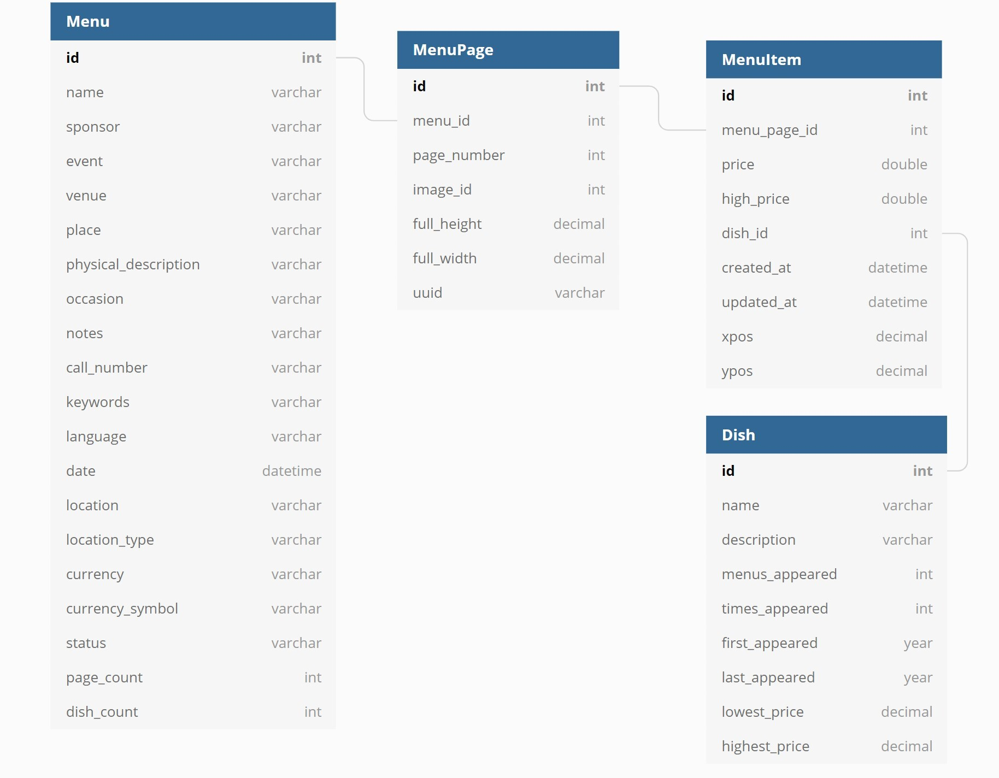

# Relational Schema

## Menu
``` sql
Table Menu {
id int [pk]
name varchar
sponsor varchar
event varchar
venue varchar
place varchar
physical_description varchar
occasion varchar
notes varchar
call_number varchar
keywords varchar
language varchar
date datetime
location varchar
location_type varchar
currency varchar
currency_symbol varchar
status varchar
page_count int
dish_count int
}
```

## Menu Item
``` sql
Table MenuItem {
  id int [pk]
  menu_page_id int [ref: > MenuPage.id]
  price double
  high_price double
  dish_id int [ref: > Dish.id]
  created_at datetime
  updated_at datetime
  xpos decimal
  ypos decimal
}
```

## MenuPage
```sql
Table MenuPage {
id int [pk]
menu_id int [ref: > Menu.id]
page_number int
image_id int
full_height decimal
full_width decimal
uuid varchar
}
```

## Dish
```sql
Table Dish {
id int [pk]
name varchar
description varchar
menus_appeared int
times_appeared int
first_appeared year
last_appeared year
lowest_price decimal
highest_price decimal
}
```

---



# Data constraints
